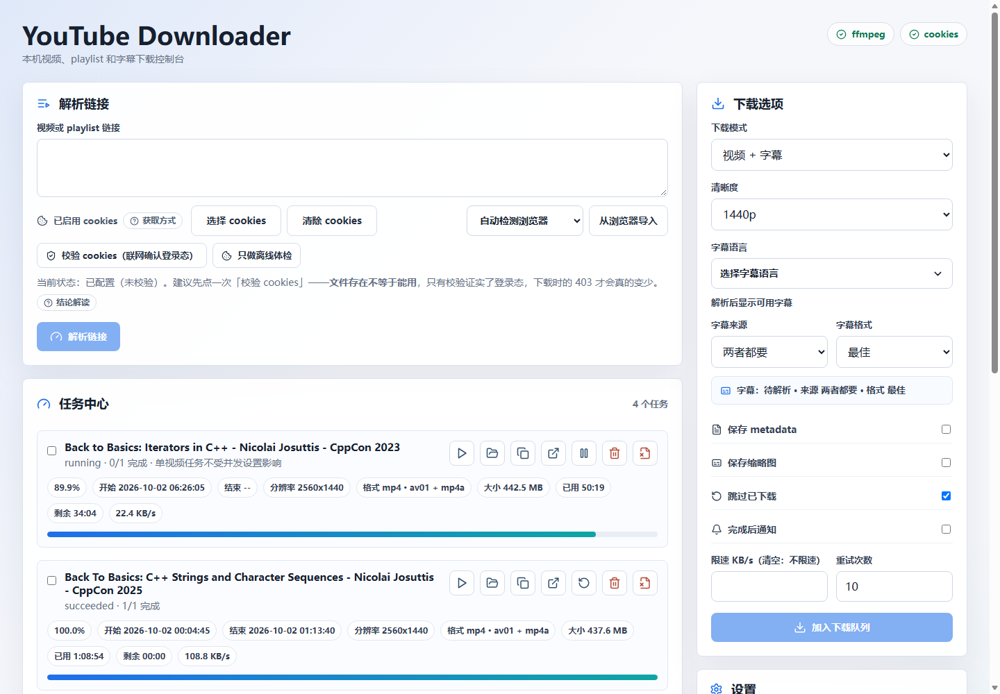

# YouTube Downloader

YouTube Downloader 是一个本机单用户下载控制台：FastAPI 后端负责调用 `yt-dlp`、维护 SQLite 任务状态和推送下载进度，React/Vite 前端提供链接解析、下载选项和任务中心。

请只下载你拥有权利或已获得许可的内容。本项目不实现 DRM 绕过，也不面向公网部署或多用户权限场景。

## 快速启动

普通使用建议走单端口模式：脚本先构建前端，再由 FastAPI 在同一个端口上同时托管页面和 API。

在仓库根目录运行对应平台的启动脚本，即可一次完成「安装依赖 → 构建前端 → 启动后端」：

```text
Windows：    powershell -ExecutionPolicy Bypass -File init\start.ps1
            （也可直接双击 init\start.bat）
Linux/macOS：bash init/start.sh
            （或先 chmod +x init/start.sh 再 ./init/start.sh）
```

默认即单端口模式。需要前端热更新开发（后端与 Vite dev server 两个进程同时跑）时，加 `dev` 参数：
`init\start.ps1 dev` 或 `bash init/start.sh dev`。脚本会自动检测并使用已有的 `.venv`（仓库根或 backend/ 下），
未检测到时使用 PATH 中的 Python 3.12+ 与 Node.js 20+。进阶启动参数见下方说明。

启动时命令会把实际监听地址打印出来，默认是 `http://127.0.0.1:8000`：

```text
服务地址：http://127.0.0.1:8000
```

打开该地址，应看到 YouTube Downloader 首页：左侧是“解析链接”和“任务中心”，右侧是“下载选项”和“设置”。界面里的解释性内容（Cookie 获取方式、校验结论解读、代理常用端口、连通性排查顺序、单视频并发下载的启用方式）**不平铺在页面上**，而是收在对应功能区旁的说明胶囊里：桌面端悬停即看、点击固定展开，窄屏展开为底部抽屉，详见 [用户手册：辅助说明的查看方式](docs/user-manual.md#辅助说明的查看方式)。截图如下：



> 改过 `frontend/src` 之后要**重新构建前端并硬刷新**（Windows `Ctrl+Shift+R`）。`init/` 脚本默认每次都会重新 `npm run build`；若你用 `--no-build` 跳过构建，则需手动 `npm run build`。
> 单端口模式发的是 `frontend/dist` 下的构建产物，重启后端只会换掉磁盘上的文件、**不会让已打开的标签页
> 重新加载**；而 `/api/events` 这条 SSE 长连接会自动重连，进度照旧滚动，很容易被误当成「页面已经是新的」。
> 症状驱动的处置见 [排障手册：重启服务后页面还是旧样子](docs/troubleshooting.md#重启服务后页面还是旧样子)。

### 端口不是固定的

端口只有一个来源：仓库根 `.env` 里的 `YTDL_API_PORT`（默认 `8000`，取值范围 `1..65535`）。后端读它，`frontend/vite.config.ts` 里前端开发服务器的 `/api` 代理读的也是它 —— 只有一处来源，才不会出现「后端换了端口、前端还代理旧端口」这种静默错配。

init 脚本底层调用的就是 `python -m app`，其进阶参数（`--port` / `--auto-port` / `--reload` / `--host` 等）可直接透传，例如 `bash init/start.sh --auto-port` 或 `init\start.ps1 --port 8010`。完整开关与「不要把 `--host` 放宽到 `0.0.0.0`」的安全警告见 [开发文档：本地运行](docs/development.md#本地运行)。

端口**不在设置面板里**（`GET/PUT /api/settings` 不含它），要改就用上面的方式。默认的 `8000` 在开发机上常被别的程序占用（例如 IncrediBuild 的 Coordinator 就长期监听它），此时 `python -m app` 不会只丢一句 `WinError 10013` —— 它会指名占用者并给出下一步，换端口与前端代理如何保持一致见
[开发文档：端口被占用时](docs/development.md#端口被占用时)，症状驱动的处置见 [排障手册](docs/troubleshooting.md#启动就失败端口被占用)。

`http://127.0.0.1:5173` 只用于前端热更新开发模式，需要另外启动 Vite dev server。不同读者的运行方式见 [用户手册](docs/user-manual.md#启动应用) 和 [开发文档](docs/development.md#本地运行)。

## 文档导航

| 文档 | 用途 |
| --- | --- |
| [文档总入口](docs/index.md) | 按读者角色选择阅读路径。 |
| [用户手册](docs/user-manual.md) | 启动入口、下载操作、代理与网络、cookies、自检与日志。 |
| [排障手册](docs/troubleshooting.md) | 按「你看到的那句话」查该点哪里：代理、cookies、JS 运行时、端口占用、页面没变化与日志阅读。 |
| [需求分析](docs/requirements.md) | 项目目标、功能需求、非功能需求和边界。 |
| [架构设计](docs/architecture.md) | 前后端、SQLite、yt-dlp、ffmpeg、SSE 和外部依赖关系。 |
| [设计文档](docs/design.md) | 模块职责与依赖分层、运行时并发模型、关键数据流、扩展点和已知限制。 |
| [4+1 架构视图](docs/4-plus-1-view.md) | 逻辑、开发、进程、物理和场景视图，用于架构审查。 |
| [开发文档](docs/development.md) | 环境准备、依赖安装、配置项、目录结构和运行命令。 |
| [文档写作环境](docs/documentation-workflow.md) | 初始化文档工具、渲染 UML、检查本地链接和生成产物。 |
| [API 文档](docs/api.md) | HTTP endpoint、请求响应模型、任务状态和诊断字段；配套机器可读规范见 [openapi.yaml](docs/openapi.yaml)。 |
| [技术文档](docs/technical.md) | 清晰度/格式选择、降级策略、cookies、PO token 和稳定下载策略。 |
| [实现文档](docs/implementation.md) | 核心模块职责、任务调度、进度聚合、读模型和数据库补列。 |
| [测试文档](docs/testing.md) | 自动测试、手动验收和回归重点。 |
| [维护文档](docs/maintenance.md) | 文档同步规则、变更 checklist 和排障流程。 |
| [安全审计报告](docs/safety-review.md) | 安全审查结论、检查清单与待复核项。 |

## 测试摘要

验证命令集中维护在 [测试文档](docs/testing.md#自动测试命令)，README 不重复展开，避免后续命令分叉。

## 维护约定

功能、命令、配置、API、架构、4+1 视图、下载策略或测试方式变化时，必须同步更新 `docs/` 中的对应文档和 UML 图。README 只作为入口页，不承载详细设计内容。
