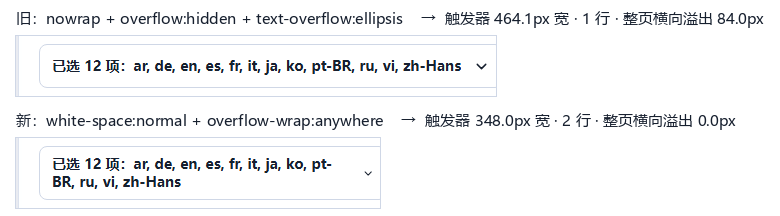

# 003 · 语言选择器的标签把整页撑出横向滚动条

- **状态**：已修复
- **提交**：随本记录同一次提交。commit hash 按 [`ai/bug-fix/`](../bug-fix/README.md) 的同样做法在下次触碰本目录时回填
- **发现于**：002 的「已知但未处理」清单（当时的描述是「同成因、但修法不同」）
- **决定**（用户 2026-10-02）：**放弃 `nowrap`，让触发器变成多行**（而不是在 JS 侧把字符串截断）

## 问题

「下载选项」面板里的字幕语言选择器，标签是数据驱动的：
`已选 N 项：en, zh-Hans, …`（`App.tsx` 的 `summary`，join 的是**语言代码**）。
选中的语言一多，标签就放不下 —— 但它的表现不是「显示不下」，而是**整个右栏被推出视口、
页面出现横向滚动条**。

用 CDP 拦截 `/api/analyze` 注入 12 种真实字幕代码（`ar, de, en, es, fr, it, ja, ko, pt-BR,
ru, vi, zh-Hans`），在**真实组件、真实复选框**上量（`tmp_acceptance/ui_language_trigger.py`）：

| 已选语言 | 整页横向溢出 | 行数 | 面板右缘 | 视口 |
|---|---|---|---|---|
| 1 / 2 / 4 / 6 / 8 | 0.00 | 1 | 1393 | 1425 |
| **12** | **84.00** | 1 | **1509.08** | 1425 |

同一状态扫宽度与窄屏（12 种语言）：

| 视口 | 1280 | 1440 | 1600 | 1728 | 900 | 640 | 390 | 360 |
|---|---|---|---|---|---|---|---|---|
| 横向溢出 | **84.00** | **84.00** | **44.00** | 0.00 | 0.00 | 0.00 | **141.00** | **171.00** |

溢出量随窗口变宽收敛到 0（1728 正常），说明是**一个固定宽度的东西在顶**。
窄屏里 900 / 640 反而是 0 —— 那两个断点下面板是整宽的，地方反而够；390 / 360 又不够了。

## 原因

```css
.select-trigger span {
  overflow: hidden;
  text-overflow: ellipsis;
  white-space: nowrap;   /* ← 这一行 */
}
```

意图很明显是「太长就省略号」。**但省略号从来没有出现过**：整个测量过程里
`span.scrollWidth - span.clientWidth` 恒为 **0.00**（标签从未被约束，所以从未被裁）。
真正发生的是这一条链：

```text
nowrap 之下没有断行机会
  → span 的 min-content = 整段文字的宽度
    （实测：12 种代码时触发器被撑到 464.08px，而它本来只有 348px）
  → span 是 flex item，而 .select-trigger（overflow: visible）的
    min-width: auto = 内容最小尺寸 → 按钮不允许被压窄
  → 按钮是 .field（display: grid）的 item → .field 的 min-content 被顶大
  → .options-panel 的 min-content 被顶大
  → .grid 的右栏轨道写死 390px（实测 gridTemplateColumns = 951px 390px），
    而 grid item 的 min-width: auto 不许它被压窄
  → 溢出被算进整页：面板右缘 1509.08 > 视口 1425
```

所以「省略号」这个意图与它的实现是背离的：**它许愿的是「省空间」，实际做的是「撑版面」。**

一个容易搞错的点（本轮实测复核过）：**给标签加 `min-width: 0` 没用**（见下表 C 方案，溢出
一点没变）。因为标签已经 `overflow: hidden`，它的自动最小尺寸本来就是 0；卡住的是
**按钮自己**的 `min-width: auto`。

## 修复方案

```css
.select-trigger {
  padding: 8px 12px;          /* 原 0 12px：只为多行留白，单行时逐像素不变 */
}

.select-trigger span {
  white-space: normal;        /* 原 nowrap：标签就地换行 */
  overflow-wrap: anywhere;    /* 单个 token 自己放不下一行时的兜底 */
}
```

- **去掉 `nowrap`**：标签不再被锁成一行，就地换行（12 种代码 → 2 行，触发器 44 → 54px）。
- **同时去掉 `overflow: hidden` 与 `text-overflow: ellipsis`**：允许换行之后它们已无意义；
  更要紧的是**留着它们会把「溢出」变成「藏起来」** —— 那正是 002 否掉 `min-width: 0` 的
  同一条理由（把可见缺陷换成不可见缺陷，不算修好），所以本轮把它一并删掉，并在探针里
  加了「标签不得被裁」与「文字实测边界不得越界」两条断言盯住。
- **`overflow-wrap: anywhere` 显式写在这里**，虽然 `.side-column` 上已有同款声明、本可继承：
  本控件是 **flex item**，它的 min-content 直接决定父级轨道宽度，组件一旦被移到别处就会
  静默退回旧病症。必须用 `anywhere` 而不是 `break-word`（后者不改变 min-content，实测无效）。
- 纵向 padding 从 `0` 改成 `8px`：只在多行时看得见；单行时 18px 文字 + 16px padding 仍不足
  44px 的 `min-height`，高度与文字位置都不变（见「效果」里的逐字段对比）。

### 为什么不选另一种改法

都在真实浏览器里量过（`tmp_acceptance/ui_lang_alternatives.py`，1440px、12 种语言）：

| 候选 | 整页溢出 | 行数 | 可见字符比 | 结论 |
|---|---|---|---|---|
| **本次方案**（允许换行） | 0.00 | 2 | 1.000 | **采用** |
| B 按钮加 `min-width: 0`（保持 nowrap） | 0.00 | 1 | **0.729** | 技术上也能消掉溢出，但代价是标签被裁掉 **27%**（实测被裁 111px）—— 信息没了，且要靠省略号猜。要可接受还得再配 tooltip / 展开入口，等于把可见缺陷换成不可见缺陷 |
| C 标签加 `min-width: 0` | **84.00** | 1 | 1.000 | **无效**，复核了上一轮的判断：卡点在按钮，不在标签 |
| D `.grid > *` / `.side-column > *` 加 `min-width: 0` | **63.00** | 1 | 1.000 | 仍溢出 63px，只是从「面板被顶宽」变成「文字画到面板外」 |
| E 加宽右栏轨道 | — | — | — | 不实测即否（**这一条是推理，不是测量**）：所需宽度随已选语言数**无上界**增长 —— 12 种代码已需触发器 464.08px（右栏得 ≥ ~500px），20 种还要更宽。加宽只是把阈值往后挪一次，还会永久收窄主功能区 |

B 与本次方案的差别值得记一笔：**两者都能让「整页横向滚动条」消失，区别在于代价付在哪里**
—— B 付在「用户看不到自己选了什么」，本次方案付在「触发器变高、把下面内容顶下去」。

## 效果



上图是**用承重注入把旧声明打回去**渲染的（内容与下图完全相同：12 种真实字幕语言代码），
下图是修复后的真实渲染 —— 两者差别只有 `.select-trigger span` 的那几条声明。
注意上下两张的**宽度差本身就是证据**：触发器从 464.1px 收回 348.0px。
生成脚本 `tmp_acceptance/ui_lang_shot_pair.py`（gitignore，非自动化覆盖）。

修复前后对照（1440px，真实语言代码）：

| 已选 | 修复前溢出 | 修复后溢出 | 修复后行数 | 触发器高 |
|---|---|---|---|---|
| 1 / 2 / 4 / 6 / 8 | 0.00 | 0.00 | 1 | 44.00 |
| **12** | **84.00** | **0.00** | **2** | **54.00** |

- 宽度扫描（12 种）：1280 / 1440 / 1600 / 1728 全部 **0.00**；
  面板右缘 1233 ≤ 1265、1393 ≤ 1425、1512.5 ≤ 1585、1576.5 ≤ 1713 —— 面板整体留在视口内。
- 窄屏（12 种）：900 / 640 → 0.00（1 行）；**390 / 360 → 141 / 171 → 0.00**（2 行、54px）。
- 毒性测试（标签里塞 120 字符不可断 token）：1181 / 1181 / 1140 → **0.00**（折成 6 行）。
- **默认态（空选）逐字段不变**：触发器 `{left 1024, top 372.19, w 348, h 44}`、
  标签 `{top 385.19, h 18}`、箭头 `{top 385.69, h 17}` —— 与修复前**完全一致**，
  所以 `docs/assets/screenshots/` 里的四张截图不需要重拍（它们拍的就是这个状态）。

## 验证

两条新断言，且**都先证明能抓住缺陷**：

1. `lets the language trigger wrap its label instead of clipping it` —— 读 `styles.css?raw`，
   断言 `.select-trigger span` 必须声明 `white-space: normal` + `overflow-wrap: anywhere`，
   且不得出现 `white-space: nowrap` / `overflow:` / `text-overflow:`。
   **把三行旧声明临时加回去 → 该例立即失败，并把实际规则体打印出来**；还原后通过。
2. `lists every selected subtitle language in the trigger label` —— 行为断言，盯住
   「不许改成 JS 侧截断」：**把 `summary` 临时改成 `已选 ${n} 项`（不列语言）→ 该例失败**；
   还原后通过。

CDP 探针 `tmp_acceptance/ui_language_trigger.py` **71/71 全绿**，其中：

- 用 CDP `Fetch` 域拦截 `/api/analyze` 注入 12 种字幕代码，让**真实 React 组件**渲染真实标签，
  再点**真实复选框**（不是往 span 里塞文本的替身）；
- **承重测试**：把 `white-space: nowrap; overflow: hidden` 用 inline `!important` 打回去 →
  1440px 的 84.00 与 1600px 的 44.00 都**错确重现**，证明前面的通过确实来自这次改动；
- **「不许藏」**：标签 `scrollWidth - clientWidth` ≤ 0.5，且文字 Range 的实测边界既不得越过
  标签框左侧、也不得越过面板内容区右缘（否则「贴边裁掉」会被误判成「没溢出」）；
- 箭头仍与触发器垂直居中、下拉开合与勾选联动正常、标签随勾选实时更新。

回归：前端 **69 passed**（67 → 69）、`npx tsc --noEmit` 通过、后端 **289 passed**、
浮层探针 `ui_help_popover_check.py` **42/42** 仍全绿。

## 风险与回滚

- **标签变长时触发器会变高**（12 种 → 54px；`overflow-wrap: anywhere` 下极端内容最多 6 行、
  约 120px），会把面板下方的内容顶下去。这是「多行」方案本身的代价，用户已明确选定；
  若要限制，需要另做产品决定（给标签设高度上限 + 滚动，或 JS 侧折叠成「+N」）。
- `overflow-wrap: anywhere` 允许在**词中断行**。实测：`pt-BR` 在行尾断成 `pt-` / `BR`
  （这是连字符处的正常断行机会，`overflow-wrap: normal` 下同样会这样断），`zh-Hans` 未断。
  这类语言代码最长 7 字符、远小于可用宽度（1440px 下约 295px），只有「单个 token 自己就
  放不下一行」时才会触发。
- 回滚：把 `.select-trigger span` 还原成三行旧声明、`padding` 改回 `0 12px` 即可，无 JS 依赖。

## 关联

- 与 [`002`](002-side-column-overflow-breaks-the-page.md) **同族但修法不同、互不替代**：
  002 的病是「文本**没有**断行机会」（Windows 路径），靠 `overflow-wrap` 让文本能断；
  003 的病是「文本被 `nowrap` **锁死成不可断**」，`overflow-wrap` 对它无效，
  必须先撤掉 `nowrap`。两者都收敛到同一条更一般的判据：

  > **往固定宽度的轨道里放「会随数据变长」的内容时，先问一句：它放不下时会怎样。**

- 与 [`001`](001-cookie-buttons-not-on-the-same-baseline.md) 共享一条方法论：**「意图」不等于「实现」**。
  001 是「写了 `margin-top: 0` 却被基类静默吃掉」，003 是「写了 `text-overflow: ellipsis`
  却一次都没生效」—— 两处都是声明存在、但语义从未发生。**只看代码会以为它有防护。**

## 未覆盖 / 如实说明

- jsdom **不做布局**，上面两条不变式只覆盖「样式源文」与「标签内容」，
  **不能**证明真实渲染不溢出；后者只由 CDP 探针覆盖，而探针在 gitignore 的
  `tmp_acceptance/` 下，**不进 CI**（与 001 / 002 同一边界）。
- 探针里的 12 种语言是**注入**的解析结果（真实 YouTube 视频的字幕轨道数不确定），
  所以「12 种开始溢出」是**注入数据下的结论**，不是对真实视频的统计。真实视频通常只有
  几种轨道、可能永远不触发；但已选语言数**没有上界**，触发只是迟早。
- 只验了浅色主题，以及 1440 / 1280 / 1600 / 1728 与 900 / 640 / 390 / 360 这些视口；
  **未验**：200% 缩放、浏览器缩放下 `overflow-wrap` 的亚像素舍入、以及非拉丁语言代码之外
  的极端内容（例如把一个 20 种语言的选择配上 200 字符的单一代码）。
- **本轮未碰**的相邻缺口：`en` 来自 settings 的 `default_subtitle_languages`，
  若解析结果的字幕语言里没有 `en`，它仍会出现在「已选 N 项：…」里，**且在下拉里没有
  对应复选框、界面上摘不掉**（本轮实测中它一直挂在标签开头）。属另一处独立的可用性缺口。

## 附：对上一轮数字的更正

002 的提交里，本目录的「已知但未处理」清单一度写着「选中 **6** 种语言就溢出 **49px**」，
并在 `ui_trigger_probe.py` 里用了 `English` / `中文（简体）` / `日本語` 这类**展示名**当语言。
后端 `_map_subtitles()` 的实际行为是 `SubtitleOption(language=<yt-dlp 字典的 key>)`，
即 `en` / `zh-Hans` / `pt-BR` 这类**代码**，`name` 字段从未被填写 —— 前端 join 的就是代码。
用展示名会把标签显著拉长，**高估了缺陷**。本轮已改用真实代码重测：**8 种仍放得下，
12 种溢出 84px**。上面所有数字均为代码版本。
