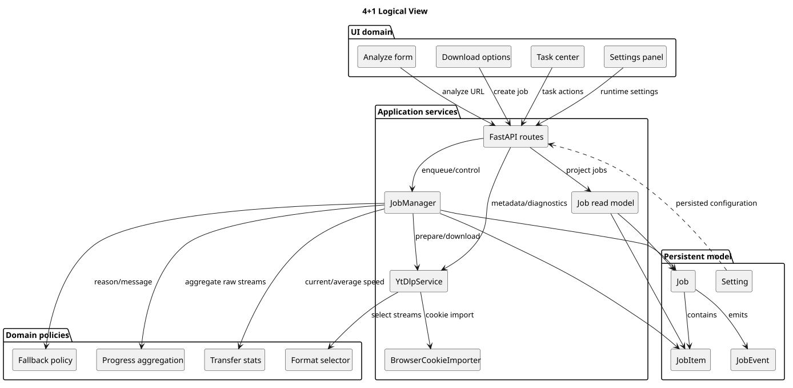
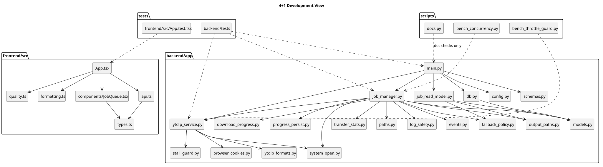
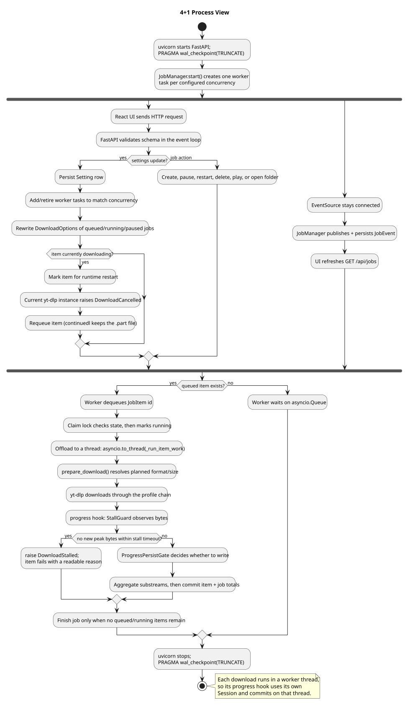
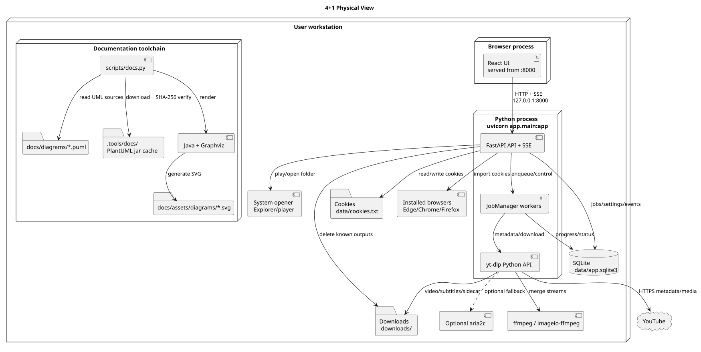
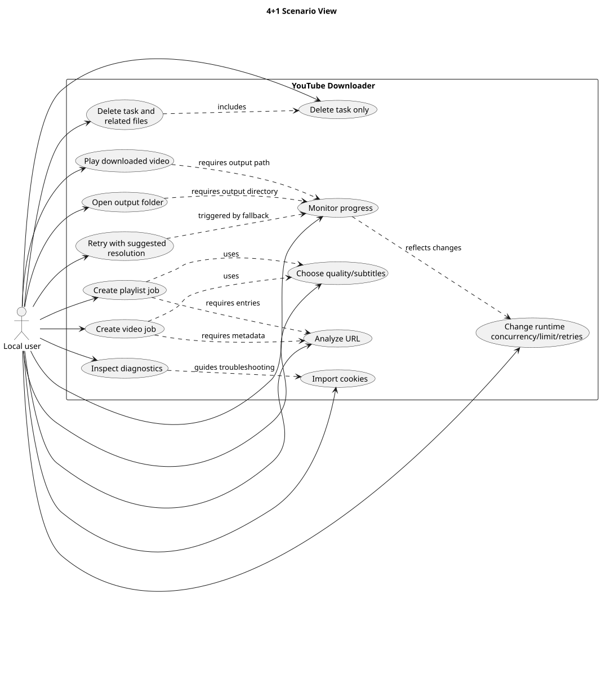

# 4+1 架构视图

适用读者：需要按软件工程架构规范审查系统设计的开发者、维护者和评审者。

本页按 Kruchten 4+1 视图组织现有架构：逻辑视图、开发视图、进程视图、物理视图，以及以关键用例串联前四类视图的场景视图。详细模块说明仍以 [设计文档](design.md)、[架构设计](architecture.md)、[实现文档](implementation.md) 和 [技术文档](technical.md) 为准，本页用于建立审查地图，避免文档和代码演进时漏掉某一类关注点。

## 视图索引

| 视图 | 关注点 | 主要验证问题 |
| --- | --- | --- |
| 逻辑视图 | 领域对象、服务职责、核心策略之间的关系。 | 职责是否清晰，业务规则是否集中在可维护边界内。 |
| 开发视图 | 源码模块、包结构、测试边界和依赖方向。 | 模块依赖是否单向、测试是否覆盖关键边界。 |
| 进程视图 | 运行时并发、队列、事件、任务状态和下载进程。 | 设置变更、任务调度、进度刷新和取消重排是否一致。 |
| 物理视图 | 本机部署节点、进程、文件、外部工具和网络依赖。 | 单机部署假设、文件访问和外部依赖是否明确。 |
| 场景视图 | 用户关键用例对前四类视图的串联。 | 常见操作是否能追踪到模块、运行流和部署资源。 |

## 逻辑视图

PlantUML 源文件：[four-plus-one-logical-view.puml](diagrams/four-plus-one-logical-view.puml)。

逻辑视图把系统分为 UI 领域、应用服务、领域策略和持久化模型。任务创建、下载、进度聚合、分辨率降级、cookies 导入和设置持久化都通过后端应用服务协调；下载策略和 fallback 文案由独立策略模块承载，避免散落在 API 路由或前端展示组件中。停滞看门狗同样作为独立策略模块挂在下载服务上，而不是混进任务管理器的状态机。

自检能力也被拆成「解析」与「证明」两件事：代理来源的**解析**（[proxy.py](../backend/app/proxy.py)）与代理**是否真的通**（[connectivity.py](../backend/app/connectivity.py)）分开，cookies 的**体检**（[cookie_health.py](../backend/app/cookie_health.py)）与 cookies 的**导入**（[browser_cookies.py](../backend/app/browser_cookies.py)）分开。理由与分层规则一致：解析是纯函数，证明要发请求，两者的失败语义和重试代价完全不同 —— 混在一起就会在排障时把「代理坏了」误判成「提取器坏了」。

## 开发视图

PlantUML 源文件：[four-plus-one-development-view.puml](diagrams/four-plus-one-development-view.puml)。

开发视图展示源码层依赖。前端由 [App.tsx](../frontend/src/App.tsx) 编排状态，展示职责拆到 [components/](../frontend/src/components/)：任务中心 [JobQueue.tsx](../frontend/src/components/JobQueue.tsx)、cookies 区 [CookieSection.tsx](../frontend/src/components/CookieSection.tsx)、代理区 [ProxySection.tsx](../frontend/src/components/ProxySection.tsx)，以及被后两者共用的说明浮层 [HelpPopover.tsx](../frontend/src/components/HelpPopover.tsx)；HTTP 边界集中在 [api.ts](../frontend/src/api.ts)。后端由 [main.py](../backend/app/main.py) 暴露 HTTP API，本地启动入口是 [__main__.py](../backend/app/__main__.py)（端口预检与占用者识别见 [dev_server.py](../backend/app/dev_server.py)），[job_manager.py](../backend/app/job_manager.py) 处理队列和 worker，[ytdlp_service.py](../backend/app/ytdlp_service.py) 隔离 yt-dlp 细节；进度聚合、落库节流、平均速度、停滞检测、输出路径解析、代理解析与连通性自检各自独立成模块，依赖方向保持「入口 → 编排 → 下载 → 纯工具」，细节见 [组件关系](architecture.md#组件关系) 与 [设计文档](design.md#前端组件边界)。

## 进程视图

PlantUML 源文件：[four-plus-one-process-view.puml](diagrams/four-plus-one-process-view.puml)。

进程视图关注运行中的并发和事件。FastAPI 请求线程负责校验、持久化和发布事件；`JobManager` worker 按当前并发从队列取出 `JobItem`；一个合集的多个子视频可以并行占用多个 worker，而**单视频任务只有一个 `JobItem`，因此不受并发设置影响**。每个子项的 yt-dlp 调用通过 `asyncio.to_thread` 落到工作线程，其进度 hook 使用自己的 SQLite session；[StallGuard](../backend/app/stall_guard.py) 在同一条 hook 链上观测字节峰值，超时即把该子项判为失败。SQLite 使用 WAL，应用启动与停止时各做一次 `wal_checkpoint(TRUNCATE)`，避免 `-wal` 侧车文件无界增长。SSE 只作为刷新信号，前端再读取 `/api/jobs` 的读模型。并发、限速和重试次数属于运行时设置，详见 [技术文档](technical.md#稳定下载策略)。

## 物理视图

PlantUML 源文件：[four-plus-one-physical-view.puml](diagrams/four-plus-one-physical-view.puml)。

物理视图明确本项目是本机单用户应用：浏览器访问 `127.0.0.1` 上的 FastAPI（端口由 `YTDL_API_PORT` 决定，默认 `8000`，启动时会打印实际地址），FastAPI 托管前端并提供 API，SQLite、cookies、下载文件和系统播放器/文件管理器都在同一台用户机器上。**端口是可配的，绑定地址不是** —— 应用只监听 `127.0.0.1`，从不暴露到网络。外部工具依赖为 `ffmpeg`（必需，缺失时高清晰度直接报错）和 `aria2c`（可选，默认关闭，同时需要 `YTDL_ARIA2C_ENABLED=true`）。文档生成环境也作为工程交付物存在于开发机：仓库内脚本管理 PlantUML jar 缓存，并调用 Java 与 Graphviz 生成 SVG。项目不面向公网多用户部署，边界见 [需求分析](requirements.md#约束与边界)。

## 场景视图

PlantUML 源文件：[four-plus-one-scenario-view.puml](diagrams/four-plus-one-scenario-view.puml)。

场景视图把用户主要用例串联起来：解析链接、选择下载选项、创建单视频或 playlist 任务、监控进度、调整运行时设置、导入 cookies、按建议清晰度重试、配置代理并验证连通、校验 cookies 登录态、查看就近的辅助说明、播放/打开文件夹，以及删除任务或相关文件。每个场景都应能回溯到 API 文档、实现文档和至少一张 UML 图。

## 持续更新规则

修改架构、模块边界、运行时任务流程、部署假设或关键用户场景时，必须同步检查本页五个视图：

- 只改 UI 文案或样式，通常无需更新 4+1 图，但若新增/删除任务中心能力、说明浮层或可配置项入口，应检查场景视图与 [用户手册](user-manual.md)。
- 修改后端模块职责、拆分文件或调整依赖方向，应更新开发视图、逻辑视图和 [模块依赖图](diagrams/module-dependencies.puml)。
- 修改任务队列、运行时设置、SSE、进度聚合、暂停/重启/删除流程，应更新进程视图、[运行时并发图](diagrams/runtime-concurrency.puml) 和 [下载数据流图](diagrams/download-data-flow.puml)。
- 修改端口、部署模式、外部工具、文件位置、播放器/文件管理器调用方式，应更新物理视图。
- 新增或删除用户关键操作，应更新场景视图，并在 [维护文档](maintenance.md#变更-checklist) 中保持 checklist 一致。
- 模块职责矩阵与已知限制的权威描述在 [设计文档](design.md)，本页只做视图级索引。
