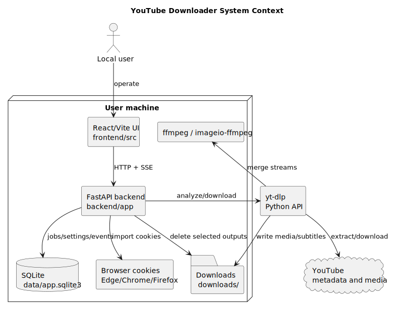
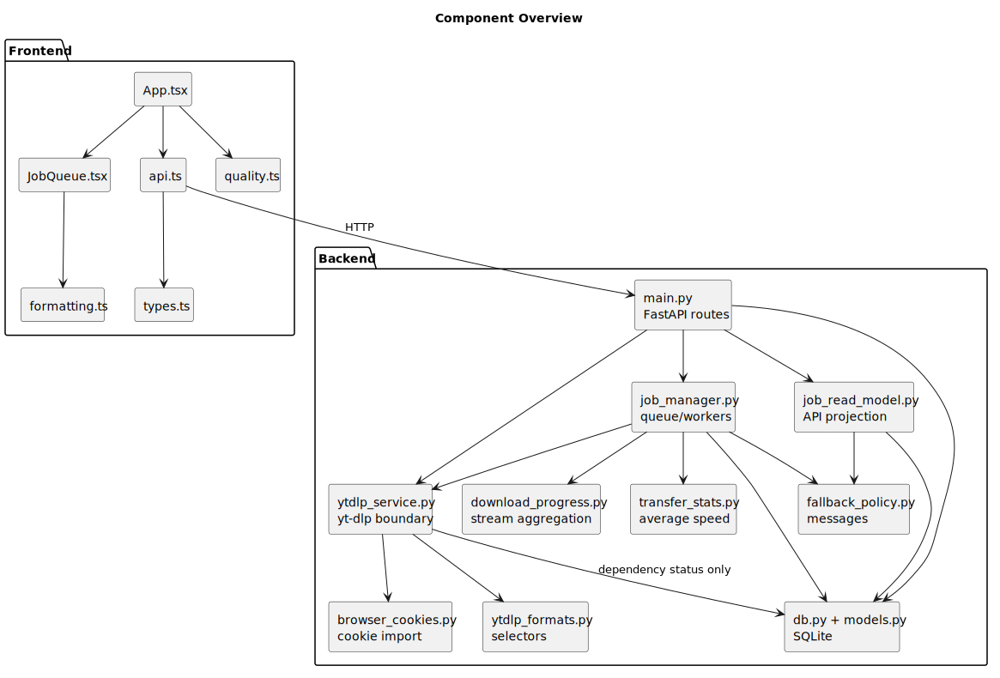
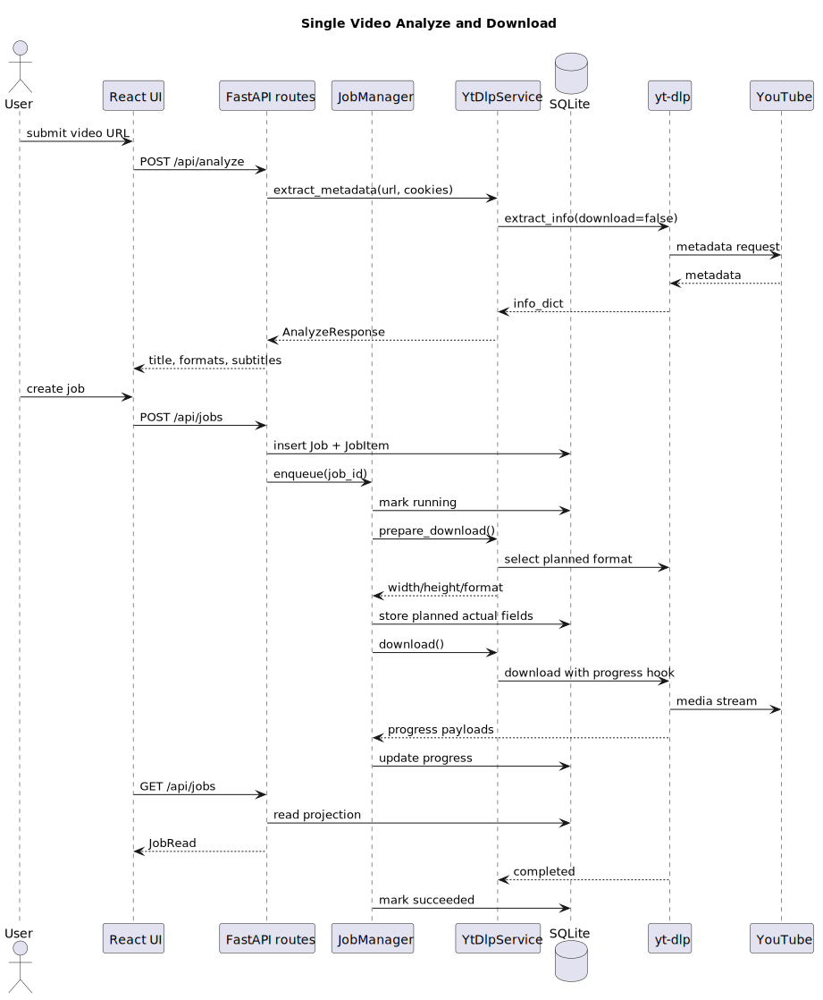
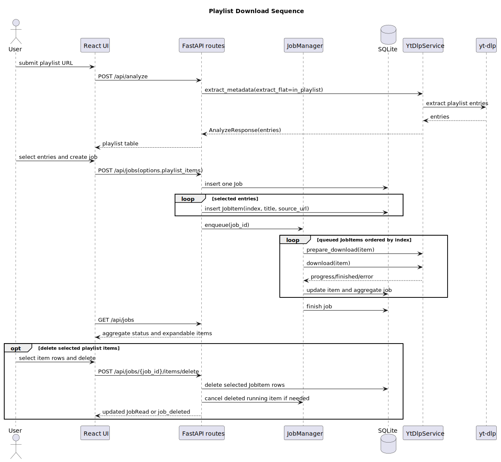
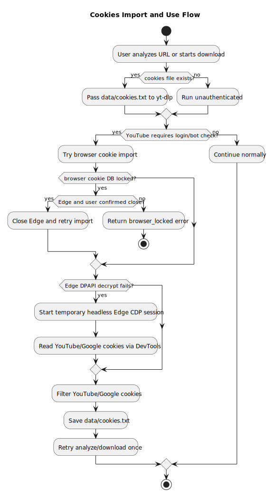
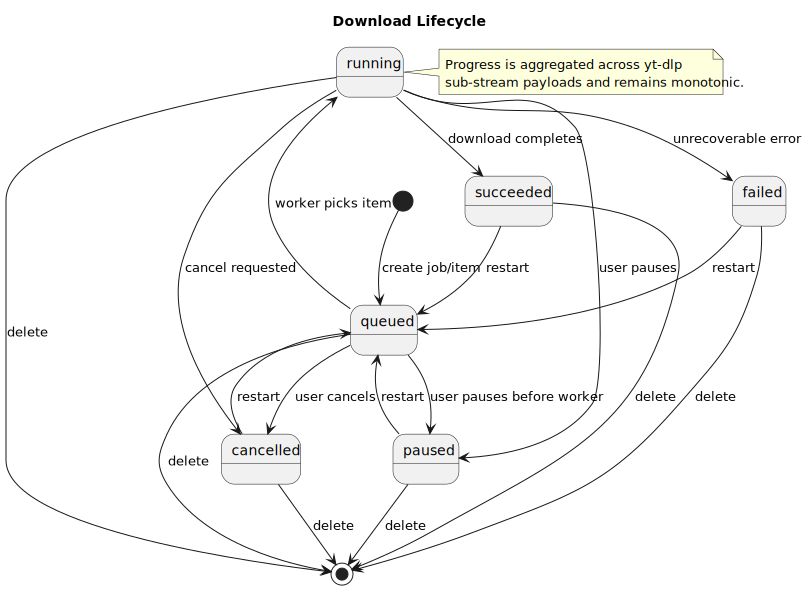
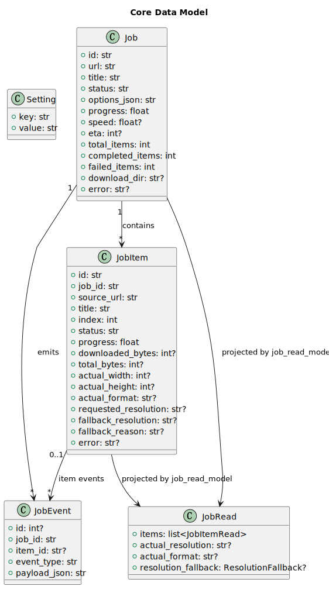

# 架构设计

适用读者：需要理解系统组成、模块边界和数据流的开发者与维护者。

## 系统上下文

PlantUML 源文件：[system-context.puml](diagrams/system-context.puml)。

系统由本机浏览器中的 React 前端、本机 FastAPI 后端、SQLite 数据库、`yt-dlp`、`ffmpeg`、浏览器 cookies 存储和 YouTube 媒体服务组成。普通使用默认由 FastAPI 在 `8000` 端口托管构建后的前端，见 [README 快速启动](../README.md#快速启动)；前端热更新开发模式见 [开发文档](development.md#本地运行)。

## 容器与职责

| 容器 | 职责 | 主要入口 |
| --- | --- | --- |
| React/Vite 前端 | 解析表单、下载选项、任务中心、cookies 操作和设置面板。 | [App.tsx](../frontend/src/App.tsx)、[api.ts](../frontend/src/api.ts#L23) |
| FastAPI 后端 | HTTP API、SSE、任务调度、SQLite 持久化、调用 yt-dlp。 | [create_app](../backend/app/main.py#L37) |
| SQLite | 存储任务、子任务、设置和事件。 | [models.py](../backend/app/models.py#L27)、[db.py](../backend/app/db.py#L10) |
| yt-dlp 服务 | 元数据解析、下载参数构建、profile 重试、格式选择和依赖诊断。 | [YtDlpService](../backend/app/ytdlp_service.py#L84) |
| 浏览器 cookies 导入器 | 从本机浏览器导入 YouTube/Google cookies，并处理 Edge 锁库和 CDP fallback。 | [BrowserCookieImporter](../backend/app/browser_cookies.py#L55) |

## 组件关系

PlantUML 源文件：[component-overview.puml](diagrams/component-overview.puml)。

后端将 API 入口、任务管理、读模型、下载服务、cookies 导入、格式选择、降级策略和进度统计分成独立模块。前端将 API 客户端、类型、格式化工具、清晰度工具和任务中心组件拆分，减少 `App.tsx` 的展示职责。

## 关键数据流

### 单视频

PlantUML 源文件：[single-video-sequence.puml](diagrams/single-video-sequence.puml)。

用户先调用 `POST /api/analyze` 获取元数据，再通过 `POST /api/jobs` 创建任务。`JobManager` 将任务入队，worker 调用 `YtDlpService.prepare_download()` 预检测，再调用 `download()` 下载。进度通过数据库、SSE 和 `/api/jobs` 回到前端。

### Playlist

PlantUML 源文件：[playlist-sequence.puml](diagrams/playlist-sequence.puml)。

Playlist 解析后由前端提交选中的条目索引。后端为每个条目创建 `JobItem`，worker 按索引逐项处理，单项失败不会阻断已完成项的状态记录。

### Cookies

PlantUML 源文件：[cookies-flow.puml](diagrams/cookies-flow.puml)。

Cookies 可手动上传或从浏览器导入。解析阶段遇到需要登录或 bot 校验时，后端会尝试自动导入并重试一次，逻辑见 [_extract_metadata_with_cookies](../backend/app/main.py#L83)。下载阶段遇到同类错误时，任务管理器会刷新 cookies 并重试当前子视频，逻辑见 [_download_with_cookie_refresh](../backend/app/job_manager.py#L464)。

## 状态生命周期

PlantUML 源文件：[download-lifecycle.puml](diagrams/download-lifecycle.puml)。

任务状态由 [JobStatus](../backend/app/models.py#L12) 定义：`queued`、`running`、`paused`、`succeeded`、`failed`、`cancelled`。任务级进度由子视频进度聚合得到，读模型见 [job_read_model.py](../backend/app/job_read_model.py#L10)。

## 数据模型

PlantUML 源文件：[data-model.puml](diagrams/data-model.puml)。

核心表是 `Job`、`JobItem`、`JobEvent` 和 `Setting`。旧数据库兼容列通过 `_ensure_columns()` 自动补齐，见 [db.py](../backend/app/db.py#L21)。

## 设计取舍

- 下载能力集中封装在 `YtDlpService`，避免 API 层暴露任意 yt-dlp 参数。
- 任务执行与 API 读模型分离，API 只读取投影，任务管理器负责状态转换。
- 分辨率降级只在下载前可判断的场景自动发生；媒体流 403/连接重置不会中途自动降级重下，详见 [技术文档](technical.md#分辨率降级原因)。
- 稳定优先运行方式：可将并发设为 1，并配合小 chunk、低速重取 URL、断点续传和同清晰度 profile 重试。
