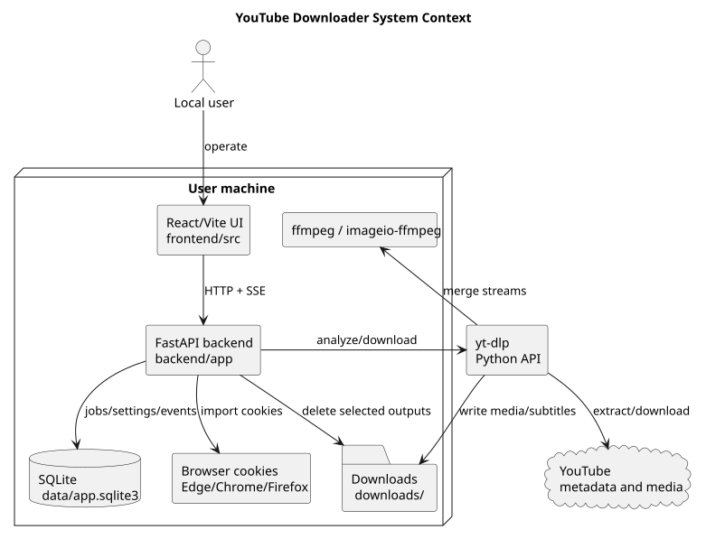
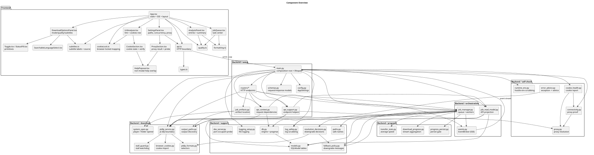
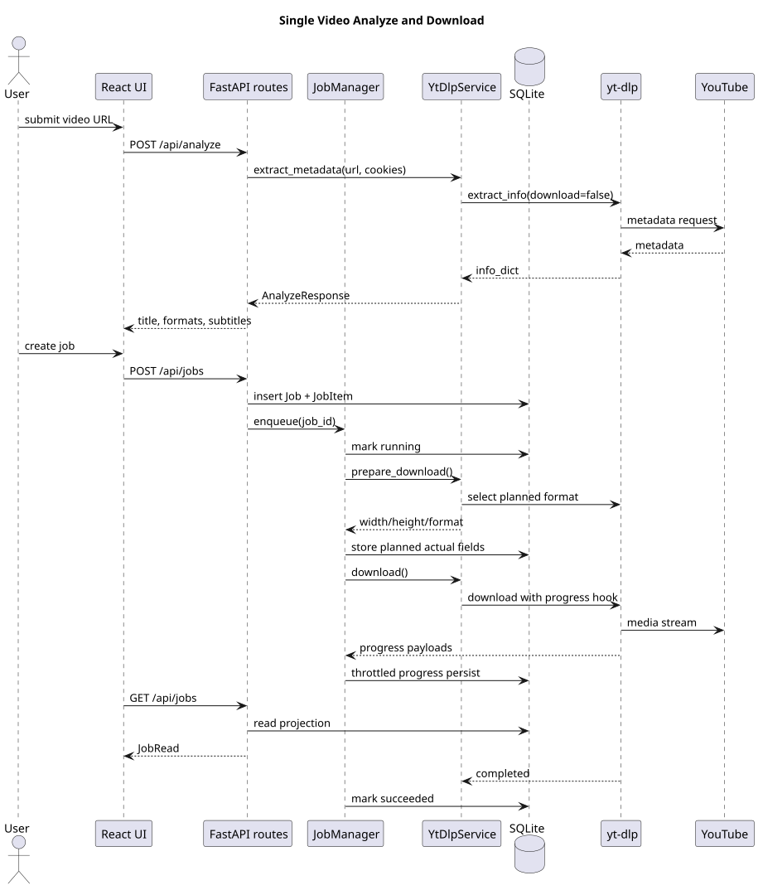
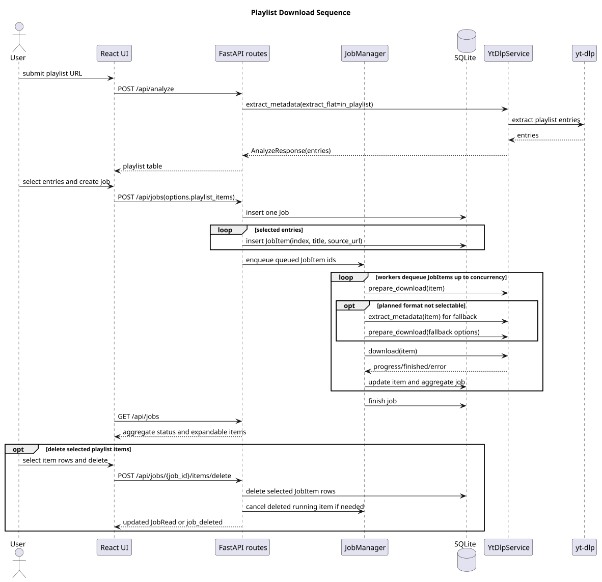
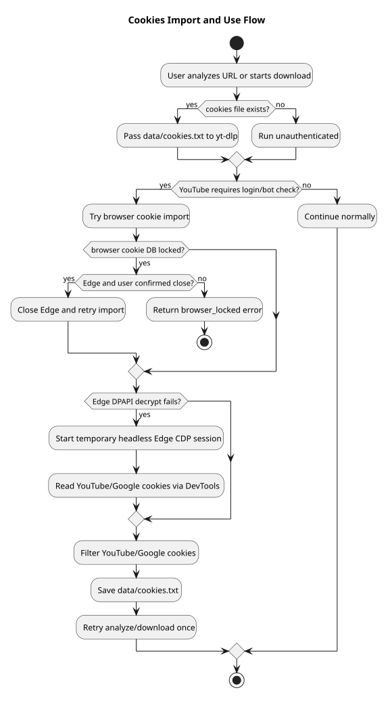
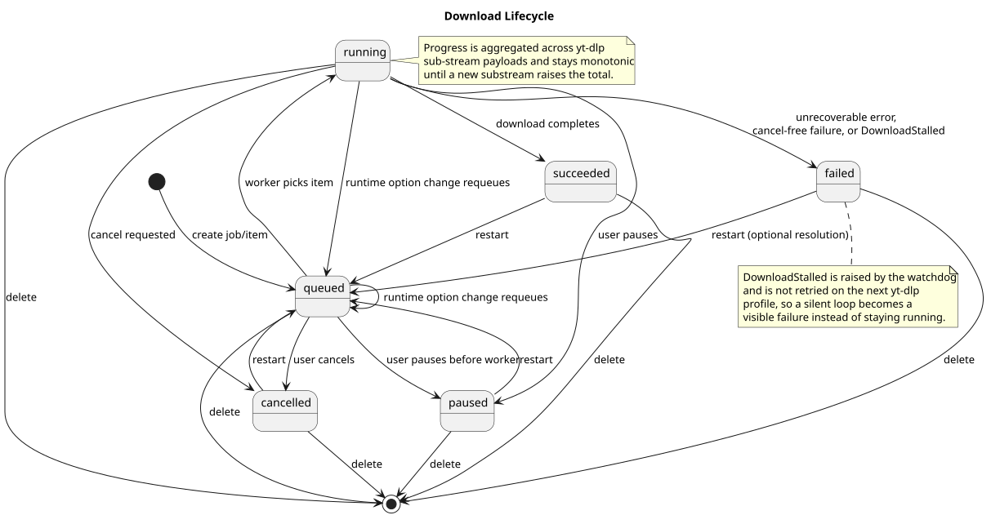
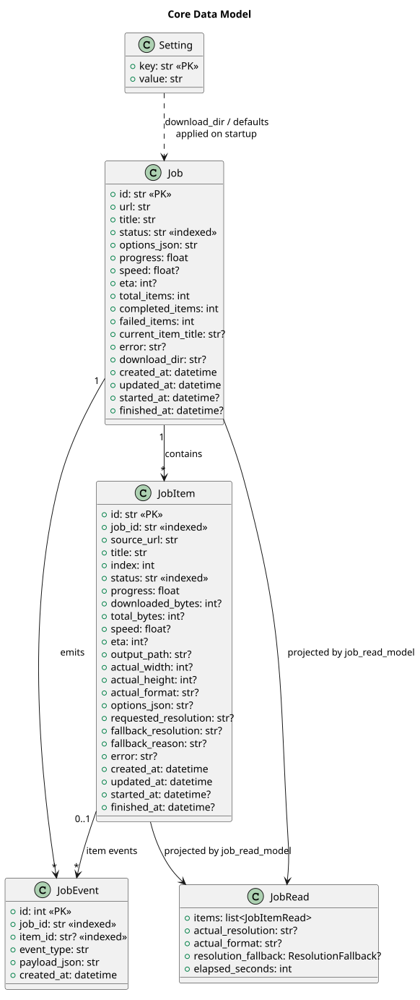

# 架构设计

适用读者：需要理解系统组成、模块边界和数据流的开发者与维护者。

如果需要按软件工程架构规范进行系统性审查，请先阅读 [4+1 架构视图](4-plus-1-view.md)。本页继续保留系统上下文、组件、数据流和状态生命周期的详细说明；模块级的职责划分、依赖方向与运行时并发模型见 [设计文档](design.md)。

## 系统上下文

PlantUML 源文件：[system-context.puml](diagrams/system-context.puml)。

系统由本机浏览器中的 React 前端、本机 FastAPI 后端、SQLite 数据库、`yt-dlp`、`ffmpeg`、浏览器 cookies 存储和 YouTube 媒体服务组成。普通使用默认由 FastAPI 在**同一个端口**上托管构建后的前端与 API，端口由 `YTDL_API_PORT` 决定（默认 `8000`，`python -m app` 启动时会打印实际地址），见 [README 快速启动](../README.md#快速启动)；前端热更新开发模式见 [开发文档](development.md#本地运行)。

## 容器与职责

| 容器 | 职责 | 主要入口 |
| --- | --- | --- |
| React/Vite 前端 | 解析表单、下载选项、任务中心、cookies 操作和设置面板。 | [App.tsx](../frontend/src/App.tsx)、[api.ts](../frontend/src/api.ts#L27) |
| FastAPI 后端 | HTTP API、SSE、任务调度、SQLite 持久化、调用 yt-dlp。 | [create_app](../backend/app/main.py#L39) |
| 启动入口 | 解析命令行、启动前做端口预检并识别占用者、把实际监听地址打印出来，再交给 uvicorn。 | [__main__.py](../backend/app/__main__.py#L64)、[dev_server.py](../backend/app/dev_server.py#L44) |
| 任务调度与执行 | 队列、worker、暂停/重启/删除、进度聚合、错误分类与终态收敛。 | [JobManager](../backend/app/job_manager.py#L43) |
| SQLite | 存储任务、子任务、设置和事件。 | [models.py](../backend/app/models.py#L27)、[db.py](../backend/app/db.py#L27) |
| yt-dlp 服务 | 元数据解析、下载参数构建、profile 重试、格式选择和依赖诊断。 | [YtDlpService](../backend/app/ytdlp_service.py#L187) |
| 停滞看门狗 | 观测 progress 回调，把静默卡死转为可见失败。 | [StallGuard](../backend/app/stall_guard.py#L32) |
| 浏览器 cookies 导入器 | 从本机浏览器导入 YouTube/Google cookies，并处理 Edge 锁库和 CDP fallback。 | [BrowserCookieImporter](../backend/app/browser_cookies.py#L67) |
| 代理与连通性自检 | 解析代理来源（显式 > 系统 > 环境变量）并**真的发一次请求**验证连通；cookies 体检则把离线格式检查与 `LOGGED_IN` 探针合成一个结论。 | [proxy.py](../backend/app/proxy.py#L169)、[connectivity.py](../backend/app/connectivity.py#L73)、[cookie_health.py](../backend/app/cookie_health.py#L234) |
| 错误翻译与自检留痕 | 把异常链翻译成「诊断 / 原因 / 建议」三段可执行结论；启动时摘除会打坏 JS 运行时的宿主环境变量并留痕。 | [error_advice.py](../backend/app/error_advice.py#L116)、[runtime_env.py](../backend/app/runtime_env.py#L58) |
| 本机打开器 | 选择可解码播放器打开视频、打开输出目录。 | [system_open.py](../backend/app/system_open.py#L23) |

## 组件关系

PlantUML 源文件：[component-overview.puml](diagrams/component-overview.puml)。

后端把 HTTP 层拆成「装配根 + 按资源分模块的路由」：`main.py` 只做装配与静态托管，路由在 [routers/](../backend/app/routers/__init__.py) 下按资源分模块（诊断、cookies、解析、任务、任务文件、设置、事件），跨路由复用的支撑逻辑在 [api_support.py](../backend/app/api_support.py) 与 [job_artifacts.py](../backend/app/job_artifacts.py)，请求级依赖容器是 [api_context.py](../backend/app/api_context.py)；再往下，任务管理、读模型、下载服务、cookies 导入、格式选择、降级决策与降级文案、代理解析与连通性自检各自独立成模块，细节见 [设计文档的模块职责矩阵](design.md#模块职责矩阵)。前端由 [App.tsx](../frontend/src/App.tsx) 只做状态编排与布局，展示职责全部在 [components/](../frontend/src/components/) 下：解析面板 [UrlAnalyzer](../frontend/src/components/UrlAnalyzer.tsx#L29)、解析结果 [AnalysisPanel](../frontend/src/components/AnalysisPanel.tsx#L12)、下载选项 [DownloadOptionsPanel](../frontend/src/components/DownloadOptionsPanel.tsx#L19)、设置 [SettingsPanel](../frontend/src/components/SettingsPanel.tsx#L18)、任务中心 [JobQueue](../frontend/src/components/JobQueue.tsx#L16)、cookies 区 [CookieSection](../frontend/src/components/CookieSection.tsx#L121)、代理区 [ProxySection](../frontend/src/components/ProxySection.tsx#L140)、语言选择 [SearchableLanguageSelect](../frontend/src/components/SearchableLanguageSelect.tsx#L16)、基础件 [Toggle](../frontend/src/components/Toggle.tsx#L4) / [StatusPill](../frontend/src/components/StatusPill.tsx#L4)，以及被多处共用的说明浮层 [HelpPopover](../frontend/src/components/HelpPopover.tsx#L42)；纯计算在 [formatting.ts](../frontend/src/formatting.ts)、[quality.ts](../frontend/src/quality.ts)、[subtitles.ts](../frontend/src/subtitles.ts)、[cookieLock.ts](../frontend/src/cookieLock.ts)，HTTP 边界集中在 [api.ts](../frontend/src/api.ts#L27)。

## 关键数据流

### 单视频

PlantUML 源文件：[single-video-sequence.puml](diagrams/single-video-sequence.puml)。

用户先调用 `POST /api/analyze` 获取元数据，再通过 `POST /api/jobs` 创建任务。`JobManager` 将任务入队，worker 调用 `YtDlpService.prepare_download()` 预检测，再调用 `download()` 下载。进度通过数据库、SSE 和 `/api/jobs` 回到前端。下载过程中 [StallGuard](../backend/app/stall_guard.py) 观测 progress 回调；如果在配置的窗口内没有新的字节峰值，任务会以可读原因失败，而不是停留在 `running`。逐段数据流见 [设计文档](design.md#关键数据流)。

### Playlist

PlantUML 源文件：[playlist-sequence.puml](diagrams/playlist-sequence.puml)。

Playlist 解析后由前端提交选中的条目索引。后端为每个条目创建 `JobItem`，worker 按并发上限同时处理多个子视频，单项失败不会阻断已完成项的状态记录。

### Cookies

PlantUML 源文件：[cookies-flow.puml](diagrams/cookies-flow.puml)。

Cookies 可手动上传或从浏览器导入。解析阶段遇到需要登录或 bot 校验时，后端会尝试自动导入并重试一次，逻辑见 [_extract_metadata_with_cookies](../backend/app/api_support.py#L87)。下载阶段遇到同类错误时，任务管理器会刷新 cookies 并重试当前子视频，逻辑见 [_download_with_cookie_refresh](../backend/app/job_manager.py#L714)。

## 状态生命周期

PlantUML 源文件：[download-lifecycle.puml](diagrams/download-lifecycle.puml)。

任务状态由 [JobStatus](../backend/app/models.py#L12) 定义：`queued`、`running`、`paused`、`succeeded`、`failed`、`cancelled`。任务级进度由子视频进度聚合得到，读模型见 [job_read_model.py](../backend/app/job_read_model.py#L12)。

## 数据模型

PlantUML 源文件：[data-model.puml](diagrams/data-model.puml)。

核心表是 `Job`、`JobItem`、`JobEvent` 和 `Setting`。旧数据库兼容列通过 `_ensure_columns()` 自动补齐，见 [db.py](../backend/app/db.py#L43)。

## 文档工具链

文档写作和 UML 生成环境也作为工程系统的一部分交付。仓库内 [docs.py](../scripts/docs.py) 管理固定版本 PlantUML jar 缓存、SVG 渲染、本地链接检查和 UML 产物一致性检查；Java 与 Graphviz 作为开发机系统依赖。安装和使用方式见 [文档写作与生成环境](documentation-workflow.md)。

## 设计取舍

- 下载能力集中封装在 `YtDlpService`，避免 API 层暴露任意 yt-dlp 参数。
- 任务执行与 API 读模型分离，API 只读取投影，任务管理器负责状态转换。
- 分辨率降级只在下载前可判断的场景自动发生；媒体流 403/连接重置不会中途自动降级重下，详见 [技术文档](technical.md#分辨率降级原因)。
- 稳定性默认值来自 [PLAN.md](../ai/perf/PLAN.md) 的修复基线：节流守卫默认关闭（`YTDL_THROTTLED_RATE_KBPS=0`），改用 90 秒停滞看门狗兜底；aria2c 多连接默认关闭，仅在显式启用且需要给单视频提速时使用。稳定优先的运行方式是把并发设为 1。
- 单端口部署：FastAPI 在 `frontend/dist` 存在时挂载静态资源并提供首页，见 [main.py](../backend/app/main.py#L117)；否则只提供 API，页面走 Vite dev server。
