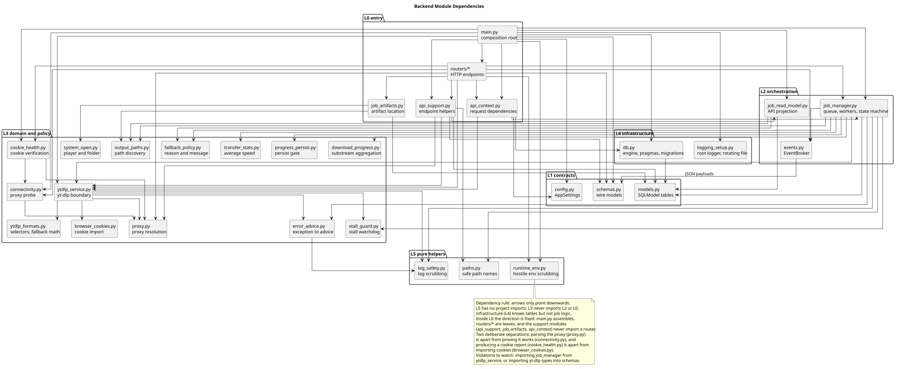
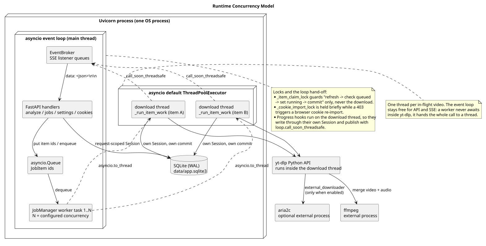
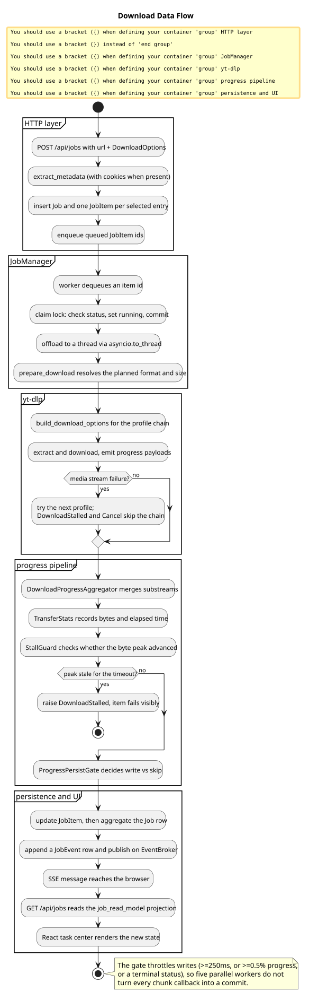

# 设计文档

适用读者：需要判断"这段逻辑该放哪一层""改动会不会破坏运行时假设"的开发者与维护者。

本页是 [架构设计](architecture.md) 的下一层：架构页回答"系统由什么组成、数据怎么流"，本页回答"模块怎么划分、依赖往哪个方向走、并发和持久化如何保证一致"。HTTP 字段级细节见 [API 文档](api.md)，参数与策略细节见 [技术文档](technical.md)。

## 设计目标与约束

| 目标 | 具体表现 | 代价 |
| --- | --- | --- |
| 本机单用户、零运维 | 单个 Python 进程 + 单文件 SQLite + 静态前端，无外部服务、无账号体系。 | 不做多用户隔离、不做水平扩展、不做跨机部署。 |
| 稳定优先 | 节流守卫默认关闭、停滞看门狗兜底、保留断点续传、同清晰度多 profile 重试。 | 单条流被限速时不再靠"换 fresh URL"自愈，只能慢速下完或等待看门狗判失败。 |
| 最小改动、可回退 | 每个行为开关都能用环境变量回退；数据库只做追加式补列。 | 没有正式迁移框架，无法安全删除/改名历史列。 |
| 失败必须可见 | 任何静默卡死最终都要变成任务中心里一条可读原因。 | 需要看门狗、错误分类和文案约束（文案不能含 `timed out` / `reset` / `403` 等会被误分类的词）。 |
| 不暴露 yt-dlp 全量能力 | API 只接受 `DownloadOptions`，不转发任意 yt-dlp 参数。 | 高级用法需要改代码，而不是改请求体。 |

## 模块职责矩阵

每个模块只承担一类职责。"不负责"一列用于判断新代码应该落到哪里。

| 模块 | 层 | 职责 | 不负责 |
| --- | --- | --- | --- |
| [main.py](../backend/app/main.py#L41) | L0 入口 | 装配应用与依赖、声明路由、错误状态码映射、静态资源托管、lifespan 启停。 | 不写业务规则，不做状态转换，不构造 yt-dlp 参数。 |
| [config.py](../backend/app/config.py#L19) | L1 契约 | 声明全部设置字段、默认值与约束、目录准备。 | 不读数据库（`Setting` 覆盖在 `main.py` 里做）。 |
| [schemas.py](../backend/app/schemas.py#L14) | L1 契约 | 定义 HTTP 线上模型与枚举。 | 不引用 yt-dlp 类型，不含业务逻辑。 |
| [models.py](../backend/app/models.py#L27) | L1 契约 | 定义持久化表结构与 `JobStatus`。 | 不做读写编排。 |
| [job_manager.py](../backend/app/job_manager.py#L35) | L2 编排 | 队列、worker、并发、暂停/重启/删除、进度 hook、错误分类、终态收敛、事件发布。 | 不直接调用 yt-dlp（经 `YtDlpService`），不解析 yt-dlp 内部结构（经 formats 工具）。 |
| [job_read_model.py](../backend/app/job_read_model.py#L12) | L2 编排 | 把表投影成 API 读模型：聚合分辨率/格式、`elapsed_seconds`、降级消息。 | 不写库、不改状态。 |
| [events.py](../backend/app/events.py#L7) | L2 编排 | 进程内 SSE 扇出（每个订阅者一个队列）。 | 不持久化事件（持久化在 `job_manager`）。 |
| [ytdlp_service.py](../backend/app/ytdlp_service.py#L88) | L3 领域 | yt-dlp 边界：元数据、预检测、参数构建、profile 重试链、错误分类、依赖诊断。 | 不碰数据库，不决定任务状态。 |
| [ytdlp_formats.py](../backend/app/ytdlp_formats.py#L9) | L3 领域 | 格式选择器、分辨率/大小/codec 提取、降级候选计算。 | 不导入 yt-dlp。 |
| [stall_guard.py](../backend/app/stall_guard.py#L32) | L3 领域 | 纯函数式停滞判定与 `DownloadStalled`。 | 不写库、不发布事件。 |
| [fallback_policy.py](../backend/app/fallback_policy.py#L10) | L3 领域 | 降级原因常量与用户可读文案、重启建议。 | 不做降级决策（决策在 `job_manager`）。 |
| [download_progress.py](../backend/app/download_progress.py#L21) | L3 领域 | 多子流进度聚合与分母策略。 | 不知道数据库和 SSE 的存在。 |
| [progress_persist.py](../backend/app/progress_persist.py#L5) | L3 领域 | 决定某个进度快照是否值得落库。 | 不执行写库。 |
| [transfer_stats.py](../backend/app/transfer_stats.py#L5) | L3 领域 | 由字节增量累加平均速度。 | 不处理瞬时速度（瞬时速度直接取 payload）。 |
| [browser_cookies.py](../backend/app/browser_cookies.py#L55) | L3 领域 | 浏览器 cookies 提取、域名过滤、锁库与 CDP fallback。 | 不决定何时刷新（决策在 `job_manager`/`main`）。 |
| [output_paths.py](../backend/app/output_paths.py#L13) | L3 领域 | 输出文件、中间文件与 sidecar 的候选路径解析与发现。 | 不删除文件（删除由 `job_manager` 在受限根目录内执行）。 |
| [system_open.py](../backend/app/system_open.py#L23) | L3 领域 | 选择可解码播放器、打开目录、窗口置前。 | 不校验文件是否存在（调用方先解析路径）。 |
| [db.py](../backend/app/db.py#L27) | L4 基础设施 | engine 创建、SQLite pragma、补列、WAL checkpoint、session 依赖。 | 不知道业务表语义。 |
| [paths.py](../backend/app/paths.py#L7) / [log_safety.py](../backend/app/log_safety.py#L11) | L5 纯工具 | 文件名安全化、日志敏感信息清洗。 | 无项目内依赖，可单独测试。 |

## 依赖方向与分层规则

PlantUML 源文件：[module-dependencies.puml](diagrams/module-dependencies.puml)。

规则：

1. 依赖只向下：L0 → L1/L2/L3/L4，L2 → L1/L3/L4，L3 → L3/L5，L4 → L1，L5 不依赖任何项目模块。
2. **L3 不得反向依赖 L2 或 L0**。典型反例：让 `ytdlp_service` 去更新 `JobItem` 状态。正确做法是把结果返回给 `job_manager`，由编排层决定状态。
3. **L1 保持纯净**：`schemas.py` 不导入 yt-dlp，`config.py` 不导入数据库层。这样 API 契约可以脱离运行时被单独审阅、测试和生成文档。
4. 新能力优先落到 L3 的单一模块（例如"判断是否需要合并音视频"属于 `ytdlp_formats.requires_ffmpeg`），只有需要"在多个模块之间做决定"时才上移到 L2。
5. 同一层内部的横向依赖要显式说明理由。当前存在的横向依赖：`job_manager` → `ytdlp_formats`（复用降级计算）与 `job_read_model` → `output_paths`（复用路径发现），两者都是复用纯函数，不构成循环。

## 运行时并发模型

PlantUML 源文件：[runtime-concurrency.puml](diagrams/runtime-concurrency.puml)。

单进程内部有两种执行载体：

- **事件循环（主线程）**：FastAPI 请求处理、`EventBroker` 扇出、`JobManager` 的 worker 任务与队列。所有状态机的状态转换发生在这一侧（其中一部分经锁保护后落到工作线程）。
- **工作线程**：每个在途视频占用一个线程。worker 任务用 `asyncio.to_thread(self._run_item_work, item_id)` 把整段下载搬出事件循环，因此 yt-dlp 的同步阻塞不会卡住 API 和 SSE。

由此推出三条必须遵守的约定：

1. **进度 hook 在工作线程上执行**，所以它使用自己的 `Session` 写库，不能复用请求级 session。
2. **从线程发布事件要跨回事件循环**：[_publish_threadsafe](../backend/app/job_manager.py#L1060) 先写 `JobEvent` 行，再 `loop.call_soon_threadsafe` 调度 `broker.publish`。异步路径直接用 [_publish](../backend/app/job_manager.py#L1047)。
3. **锁只保护状态转换，不保护下载**：`_item_claim_lock` 只覆盖"刷新 → 校验 queued → 置 running → commit"；`_cookie_import_lock` 只在 403 后的 cookies 刷新导入期间持有。下载本身靠 `should_cancel` 回调协作取消，而不是靠锁。

并发度语义：并发是**视频级**的——worker 数等于当前并发设置，队列里流动的是 `JobItem` id。单视频任务只有 1 个 `JobItem`，因此并发设置对它无效；`set_concurrency()` 通过新增 worker 任务或投放 `None` 哨兵来调整规模。

## 关键数据流

PlantUML 源文件：[download-data-flow.puml](diagrams/download-data-flow.puml)。

### 解析链接

`POST /api/analyze` → `YtDlpService.extract_metadata()`（`extract_flat="in_playlist"`，带 cookies）→ `AnalyzeResponse`。若 yt-dlp 抛出的错误同时命中 cookies 提示词，则自动导入浏览器 cookies 后**重试一次**，见 [_extract_metadata_with_cookies](../backend/app/main.py#L96)。

### 建任务与入队

`POST /api/jobs` → 解析 → 选条目（单视频合成 1 条 `VideoEntry`）→ 写 `Job` + N 个 `JobItem` → `enqueue()` 把 queued item id 放进队列。playlist 任务会额外在下载根目录下按安全化标题创建子目录，见 [_job_download_dir](../backend/app/main.py#L545)。

### 下载与进度

worker 领取 item → 声明式预检测（`prepare_download`，命中则不再二次 `extract_metadata`）→ 下载 → 进度 hook 依次经过 `StallGuard` 与 `DownloadProgressAggregator`，再由 `ProgressPersistGate` 决定是否落库 → `JobEvent` 持久化 + SSE 通知 → 前端收到信号后重新拉取 `/api/jobs` 读模型。终态写入平均速度并收敛任务状态。

### 设置变更

`PUT /api/settings` → 写 `Setting` 行 → 按字段分派副作用：并发调整 worker 数；限速/重试改写 queued/running/paused 任务的 `options_json`，并把正在运行的 `JobItem` 标记为待重启（`_runtime_restart_items`），让当前 yt-dlp 实例抛出 `DownloadCancelled` 后重新入队，靠 `.part` 续传应用新参数；aria2c 连接数只更新设置与 `YtDlpService`。

### 删除与文件清理

删除统一走 `JobManager`：先删数据库记录与关联 `JobEvent`，再按需删除文件。文件删除只在"下载根目录"或"该任务下载目录"之内执行，并对 `output_path`、合并后的最终文件与 sidecar 分别枚举候选，见 [_delete_output_files](../backend/app/job_manager.py#L342)。删除 playlist 的最后一个子项时父任务一并删除。

## 状态机与一致性

`Job` 与 `JobItem` 共用 `JobStatus` 六态，但驱动者不同：

- `JobItem` 由 worker 驱动：认领时置 `running`，结束按结果置 `succeeded` / `failed` / `cancelled` / `paused`。
- `Job` 由 [_maybe_finish_job](../backend/app/job_manager.py#L455) 收敛：只要还有 running 或 queued 子项就保持 `running`；全部结束才由 [_finish_job](../backend/app/job_manager.py#L723) 判定终态（有失败项 → `failed`；被暂停 → `paused`；被取消 → `cancelled`；否则 `succeeded`）。
- 任务级进度是子项进度的算术平均，见 [_refresh_job_counts](../backend/app/job_manager.py#L771)。

并发一致性依赖三点：单条 `JobItem` 只会被一个 worker 认领（`_item_claim_lock` + 状态校验）；worker 线程各自持有 session 并独立 commit；读模型只读不写，避免与写入路径争抢状态。

## 持久化设计

| 决策 | 内容 | 理由 |
| --- | --- | --- |
| WAL + `busy_timeout=5000` + `synchronous=NORMAL` | 每个连接建立时下发 pragma，见 [_configure_sqlite_connection](../backend/app/db.py#L14)。 | 多 worker 并发写入时"等待"而不是直接 `database is locked`；被其他进程锁住时只跳过 pragma，不让应用起不来。 |
| 追加式补列 | [_ensure_columns](../backend/app/db.py#L43) 用 `PRAGMA table_info` + `ALTER TABLE ADD COLUMN`。 | 兼容旧库，无需迁移框架。**只支持追加**，不支持删除/改名/改类型。 |
| WAL checkpoint | lifespan 启动与停止各执行一次 `wal_checkpoint(TRUNCATE)`，见 [checkpoint_wal](../backend/app/db.py#L72)。 | 避免进程被强杀后 `-wal` 侧车无界增长，也避免每次读都回放 WAL。失败只记日志。 |
| 进度写入节流 | `ProgressPersistGate`：首次、终态、间隔 ≥250ms 或进度跳变 ≥0.5% 才写。 | 5 路并行时避免把每个 chunk 回调都变成一次事务。 |
| 进度聚合 | `DownloadProgressAggregator` 按子流分别累计已下载字节，分母取"各子流已知总和的较大者"并以下限钳制。 | 字幕/chunk/分离音视频都会各自回调；不能让小文件或当前 chunk 的 100% 冒充整体完成，也不能把已下载字节归零。 |

## 错误分类与可观测性

错误分类集中在 `YtDlpService` 的静态判定函数上，`job_manager` 只消费分类结果：

| 分类 | 判定依据 | 处理 |
| --- | --- | --- |
| cookies 缺失/需登录 | 错误链中出现 cookies 提示词 + 登录/bot 关键词，见 [is_cookie_required_error](../backend/app/ytdlp_service.py#L519)。 | 刷新浏览器 cookies 后重试一次；仍失败则给出两条可操作建议。 |
| 媒体流阻断 | 403/`forbidden` 或连接重置族关键词，见 [is_media_stream_blocked_error](../backend/app/ytdlp_service.py#L470)。 | 在同清晰度下换 profile 重试；终态文案前置 cookies 状态，并给出降清晰度重启建议。 |
| 目标格式不可用 | 错误文本含 `requested format is not available`。 | 标注 `requested_resolution_unselectable` 并把错误替换成降级说明。 |
| 停滞 | 看门狗判定字节峰值超时未刷新。 | 直接失败，不换 profile、不重试。 |
| 其他 | 兜底。 | 透传清洗后的错误文本，见 [readable_error_message](../backend/app/ytdlp_service.py#L499)。 |

可观测性由三处构成：任务中心读模型（进度/速度/大小/实际分辨率/格式/错误）、`/api/diagnostics`（依赖与稳定性参数，且不回显 token 原文）、以及 `JobEvent` 表（事件审计，可与 SSE 推送交叉核对）。

## 扩展点

| 想做的事 | 正确落点 |
| --- | --- |
| 新增一个下载 profile（新的 player client / impersonation 组合） | 在 `ytdlp_service.py` 加常量并扩展 `_download_profiles()`、`_youtube_extractor_args()`、`_impersonation_target()`；若属于 anti-403 链路需同步 `YOUTUBE_ANTI403_PROFILES`。 |
| 新增一个可配置项 | `config.py` 加字段 → 需要的话在 `main.py` 的 `_apply_stored_settings` / `_settings_response` 与 `Setting` 表打通 → 补 `/api/settings` 与诊断字段 → 更新环境变量文档。 |
| 新增一个降级原因 | 在 `fallback_policy.py` 加常量与文案，并补一条 `restart_resolution` 规则；不要在 `job_manager` 里内联中文字符串。 |
| 新增一个 API | 在 `main.py` 声明路由，模型放 `schemas.py`；涉及状态转换的一律委托 `JobManager`，不直接改表。 |
| 新增一种错误分类 | 在 `YtDlpService` 加静态判定函数，在 `_log_item_failure` 加类别名，并补单测确认不会与其他分类互相误命中（尤其注意关键词冲突）。 |

## 已知限制与设计债

1. **停滞判定依赖 progress 回调**：如果 yt-dlp 完全阻塞在 socket 读且不回调，看门狗不会触发，此时只有 `socket_timeout=30` 兜底。因此不能声称"解决了所有卡死"。
2. **进程重启不恢复在途任务**：历史 `queued`/`running` item 在进程退出后不会自动重新入队或标记为取消，界面上表现为"永远排队"。这是可靠性问题，已在 [PLAN.md](../PLAN.md) 第 8 节记录为待单开计划处理。
3. **无正式迁移框架**：`_ensure_columns` 只能加列。删除列、改类型或数据回填都需要手工 SQL，且没有版本记录表。
4. **单视频无法内部并行**：yt-dlp 内建 http 下载器是单连接，`concurrent_fragment_downloads=1`，因此单视频提速只能靠 aria2c（默认关闭，且会推高 403 风险）。
5. **profile 链是串行且昂贵的**：每个 profile 都是一次完整 extract，失败路径的耗时按 profile 数累加；`DownloadStalled` 与 `DownloadCancelled` 已跳过链路，其余错误仍会逐级重试。
6. **`notify_on_complete` 未接线**：请求模型接受该字段但下载链路不消费，属于历史遗留字段。
7. **`data/` 下的旧库可能存在大量历史 item**：影响验收统计，也说明缺少归档/清理策略。

以上限制的共同验证方式是 [测试文档](testing.md) 的自动测试与离线基准；涉及真实网络的验收必须以真实的 cookies 与连通性为前提，不能用手工观察替代。
