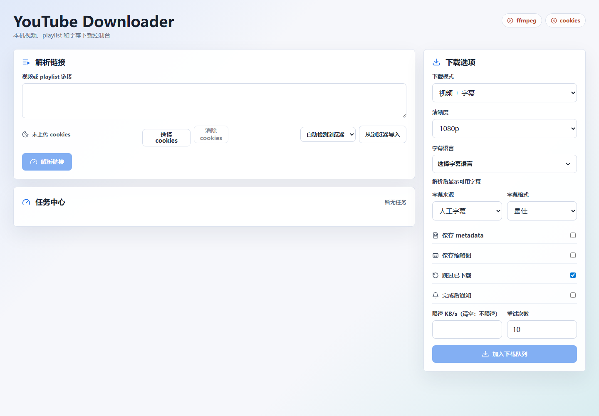

# 用户手册

适用读者：需要在本机解析、下载单视频或 playlist 的用户。最短启动命令见 [README 快速启动](../README.md#快速启动)，开发环境和依赖细节见 [开发文档](development.md)。

## 项目定位

YouTube Downloader 是本机单用户工具。前端提供链接解析、下载选项和任务中心，后端通过 `yt-dlp` 下载媒体并用 SQLite 保存任务状态。系统入口由 [FastAPI 应用](../backend/app/main.py#L37) 和 [React 应用](../frontend/src/App.tsx) 组成。

请只下载你拥有权利或已获得许可的内容。本项目不绕过 DRM、会员、地区、年龄、私有视频等权限限制。

## 启动应用

普通用户按 [README 快速启动](../README.md#快速启动) 执行即可。该方式会先生成 `frontend/dist`，再由 FastAPI 托管静态页面，浏览器打开 `http://127.0.0.1:8000`。

打开后预期看到 YouTube Downloader 首页：左侧包含“解析链接”和“任务中心”，右侧包含“下载选项”，顶部状态条会显示 `ffmpeg` 和 `cookies` 状态。首页示例：

`http://127.0.0.1:5173` 是开发者热更新入口；只有按 [开发文档的开发模式](development.md#本地运行) 启动 Vite dev server 后才应访问该端口。

## 基本下载流程

1. 在首页输入单视频或 playlist 链接，点击解析。
2. Playlist 会展示条目列表，可选择要下载的子视频；后端会根据选择生成 `JobItem`，见 [创建任务路由](../backend/app/main.py#L126)。
3. 在下载选项中选择下载模式、清晰度、字幕语言、字幕来源、字幕格式、metadata、缩略图、限速、重试和通知；默认清晰度为 `1440p`，默认字幕来源为“两者都要”。
4. 点击加入下载队列，在任务中心观察进度、速度、预计剩余时间、实际分辨率和实际格式。
5. 对任务执行暂停、重启、仅删除任务，或删除任务并删除已下载文件；前端 API 调用见 [api.ts](../frontend/src/api.ts#L75)。

## 下载选项

下载选项的数据结构由 [DownloadOptions](../backend/app/schemas.py#L56) 定义，前端对应类型见 [types.ts](../frontend/src/types.ts#L43)。

| 选项 | 行为 |
| --- | --- |
| 下载模式 | 支持视频+字幕、仅视频、仅字幕。 |
| 清晰度 | 默认 `1440p`。用户只选择清晰度；具体格式由后端自动选择。若源视频没有该清晰度，后端会按降级策略给出明确原因。 |
| 字幕语言 | 可选择人工字幕、自动字幕或两者；当前视频没有任何字幕时，界面显示“无字幕”。 |
| 字幕来源 | 默认“两者都要”。若人工字幕或自动字幕缺失，界面会提示已 fallback 到另一种可用字幕来源。 |
| 字幕格式 | 默认“最佳”；界面会显示实际提交的字幕来源和字幕格式。 |
| 跳过已下载 | 默认开启，避免覆盖已有文件。 |
| 限速 KB/s（清空：不限速） | 默认空值，不限速；填写后才传给 yt-dlp 的 `ratelimit`。 |
| 重试次数 | 默认 10，用于 yt-dlp 下载重试。 |

设置面板中的并发默认值为 5；如果网络连接不稳定，建议改为 1。

清晰度和格式的具体选择规则集中记录在 [技术文档](technical.md#清晰度与格式选择)。

## 任务中心

任务中心展示任务级和子视频级状态。后端 API 返回的字段见 [JobRead](../backend/app/schemas.py#L123) 和 [JobItemRead](../backend/app/schemas.py#L95)，前端展示组件见 [JobQueue](../frontend/src/components/JobQueue.tsx#L13)。
Playlist 展开后会用浅色分组背景承载子视频列表，便于区分合集任务行和单个视频任务。

| 信息 | 说明 |
| --- | --- |
| 进度 | 运行中显示聚合进度；分离音视频流不会在音频流开始时回退到 0。 |
| 视频大小 | 下载前预检测到文件大小时即显示计划大小；下载中会随 yt-dlp 进度校准；下载完成后保留最终大小。 |
| 速度 | 运行中显示瞬时速度；结束后保留平均速度。 |
| 实际分辨率/格式 | 下载前预检测后即写入，完成后再按 yt-dlp payload 或输出文件校准。 |
| 失败原因 | 单视频失败时直接显示具体错误；playlist 可展开查看每个子视频错误。 |
| 自动降级提示 | 根据后端 `resolution_fallback.message` 展示，原因详见 [技术文档](technical.md#分辨率降级原因)。 |
| 播放视频 | 已有输出文件的单视频任务和 playlist 子视频可点击播放按钮；后端会优先选择 VLC、mpv、PotPlayer、MPC 等更可靠的播放器，找不到可确认能解码当前格式的播放器时，错误会显示在对应任务行附近，并提示当前格式和建议播放器。 |
| 打开视频文件夹 | 已有输出文件或任务下载目录的单视频任务和 playlist 子视频可点击文件夹按钮，打开视频所在目录；Windows 下会新开 Explorer 窗口并尽量置前，避免只在任务栏闪烁；若本地文件操作失败，错误会显示在对应任务行附近。 |
| 打开合集文件夹 | Playlist 任务行可点击文件夹按钮，打开该合集下载目录；Windows 下会新开 Explorer 窗口并尽量置前。 |
| 复制链接 | 单视频任务、playlist 任务和 playlist 子视频都可点击复制按钮复制源链接。 |
| 打开 YouTube 页面 | 单视频任务、playlist 任务和 playlist 子视频都可点击外链按钮打开对应 YouTube 页面。 |
| 删除操作 | 每个任务和 playlist 子视频都提供“仅删除任务”和“删除任务并删除已下载文件”两个入口；任务中心和 playlist 展开区都支持多选后批量删除；删除文件入口使用文件删除图标并会先弹出确认框。 |

对于旧任务或下载中任务，如果数据库还没有记录最终 `output_path`，后端会按 YouTube 视频 id 在任务下载目录中查找已存在的视频、部分下载文件和 sidecar 文件。找到最终视频时，播放按钮会恢复可用；只有部分下载文件时，打开文件夹和删除文件仍可工作。

## Cookies

当 YouTube 要求登录、年龄验证或 bot 校验时，可以在解析面板中导入 cookies：

- 点击“选择 / cookies”上传 Netscape 格式 `cookies.txt`。
- 从浏览器导入时可选择“自动检测浏览器”或指定 Edge、Chrome、Firefox、Brave、Chromium 等，见 [browser_cookies.py](../backend/app/browser_cookies.py#L19)。
- Edge 正在运行导致 cookies 数据库锁定时，应用会提示用户确认后再关闭 Edge 并重试，错误结构见 [BrowserCookieImportError](../backend/app/browser_cookies.py#L30)。
- Edge DPAPI 解密失败时，后端会尝试临时 headless Edge DevTools fallback，流程见 [browser_cookies.py](../backend/app/browser_cookies.py#L157)。

Cookies 会保存到本地 `data/cookies.txt`，该目录不进入 Git。

## 下载目录与产物

默认下载根目录是 `downloads/`，数据库和 cookies 默认在 `data/`，配置默认值见 [AppSettings](../backend/app/config.py#L19)。Playlist 会在下载根目录下创建同名子文件夹；目录选择和保存逻辑见 [main.py](../backend/app/main.py#L275)。

## 常见问题入口

- 分析失败或提示 bot 校验：先重新导入 cookies，详见 [技术文档](technical.md#cookies-与登录态)。
- 媒体流 403 或连接重置：查看 [稳定下载策略](technical.md#稳定下载策略)。
- 高分辨率下载失败：查看 [清晰度与格式选择](technical.md#清晰度与格式选择) 和 [分辨率降级原因](technical.md#分辨率降级原因)。
- API 字段含义不清楚：查看 [API 文档](api.md)。
- 本地依赖或环境问题：查看 [开发文档](development.md)。
